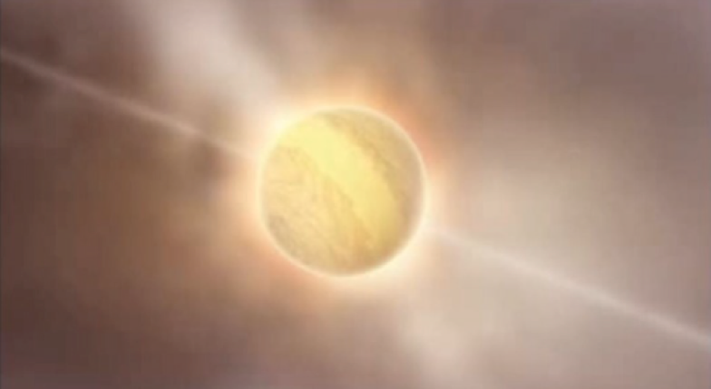
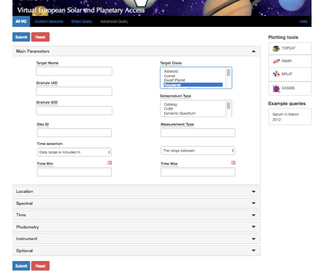
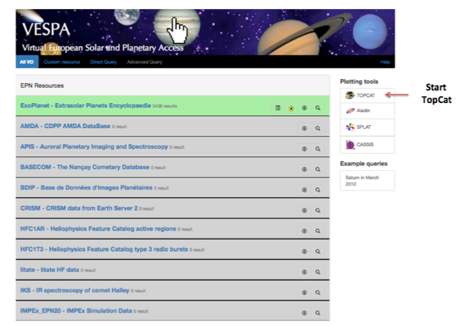
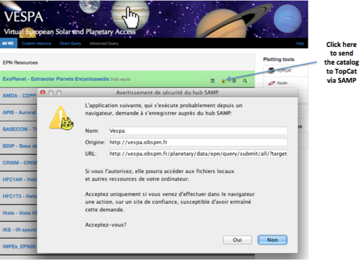
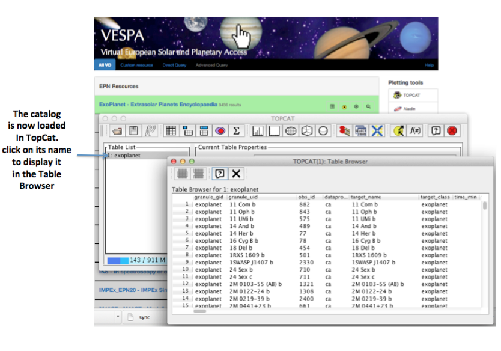
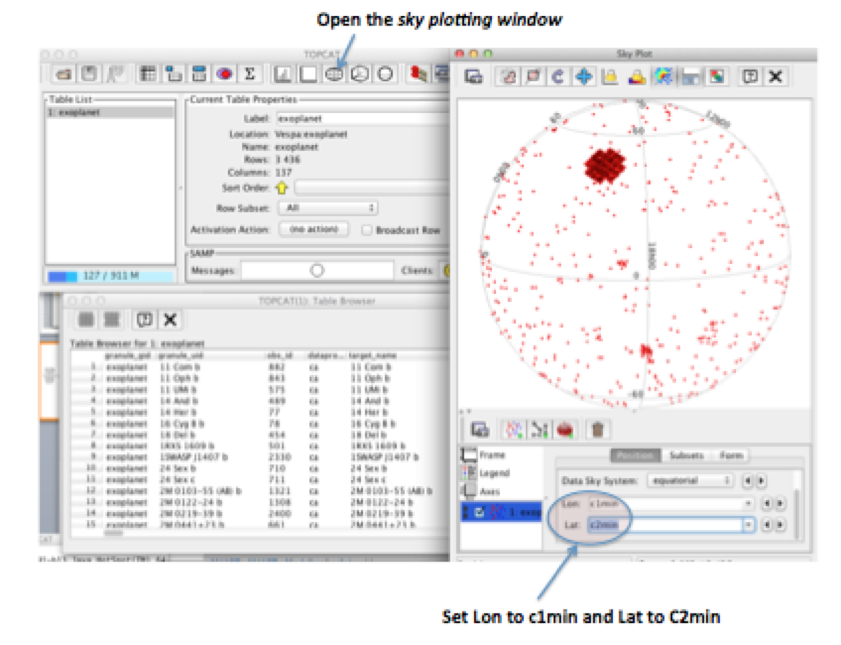
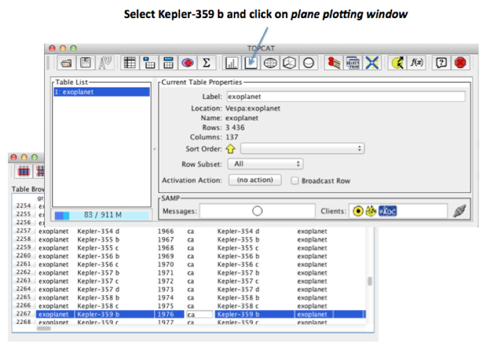
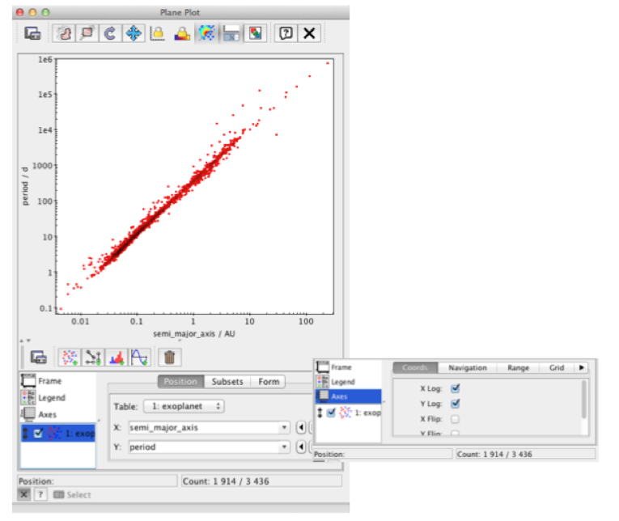

# hello-world
Test repository - This repository is created to conduct several tests for VESPA
This change is made by Michel Gangloff on Thursday October 27th
# EXPLORING EXOPLANETS

     http://exoplanet.eu
* Prepare a query on the VESPA portal ; select _exoplanet_ as target_class 

* Next step: Start Topcat

* Next step: send the catalog of exoplanets to the SAMP HUB

* Click on _Oui_ (or _Yes_) in the security pop-up window
* Next step : display the catalog in the Table Browser of TopCat

* Next step : open the _Sky plotting window_

* Plot Kepler 359-B and check third Kepler's law

* Next step:

